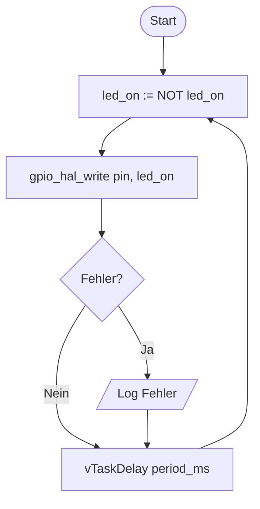
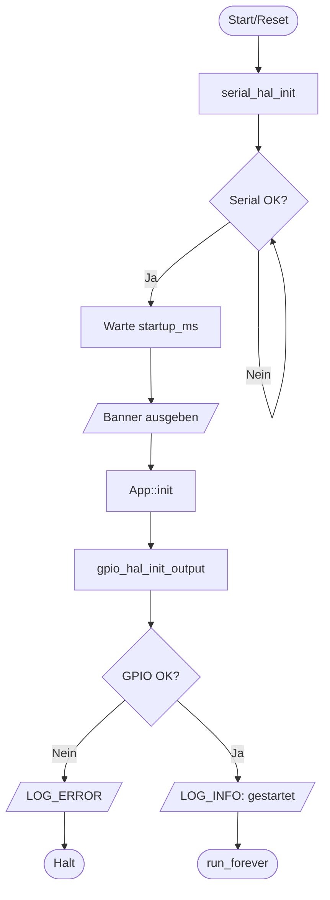

# Algorithmen

Algorithmische Spezifikationen fuer das esp32s3_ref Projekt.

---

## Grundprinzip

**Embedded-Algorithmen** sind terminierende Schritte pro Zyklus/Event:

- `App::run_forever()` = Endlosschleife (Systembetrieb)
- Einzelne Operationen darin = Algorithmen (terminierend)

**Format:** Input → Verarbeitung → Output

---

## A) Blink-Algorithmus

### Spezifikation

```
ALGORITHM BlinkStep
────────────────────────────────────────
INPUT:
  - pin        : gpio_num_t    (APP_BLINK_GPIO)
  - period_ms  : uint32_t      (APP_BLINK_PERIOD_MS)

STATE:
  - led_on     : bool          (initial: false)

OUTPUT:
  - GPIO-Level : 0 oder 1

STEPS:
  1) led_on := NOT led_on
  2) gpio_write(pin, led_on)
  3) wait(period_ms)
  4) RETURN to step 1 (loop)

TERMINATION:
  - Jeder Step (1-3) terminiert in O(1)
  - Loop laeuft endlos (Systembetrieb)
────────────────────────────────────────
```

### Mapping auf Code

| Algorithmus-Element | Datei | Funktion/Konstante |
|---------------------|-------|-------------------|
| INPUT pin | `include/common/app_config.h` | `APP_BLINK_GPIO` |
| INPUT period_ms | `include/common/app_config.h` | `APP_BLINK_PERIOD_MS` |
| STATE led_on | `src/app/app.hpp` | `App::_led_on` |
| Step 1-2 | `src/app/app.cpp` | `App::_toggle_led()` |
| Step 3 | `src/app/app.cpp` | `vTaskDelay()` in `run_forever()` |
| gpio_write | `src/hw/gpio_hal.c` | `gpio_hal_write()` |
| OUTPUT/Fehler | `include/common/error_codes.h` | `error_code_e` |

### Flussdiagramm



---

## B) Initialisierungs-Algorithmus

### Spezifikation

```
ALGORITHM AppInit
────────────────────────────────────────
INPUT:
  - baud       : uint32_t      (APP_SERIAL_BAUD)
  - startup_ms : uint32_t      (APP_SERIAL_STARTUP_MS)
  - led_pin    : gpio_num_t    (APP_BLINK_GPIO)

OUTPUT:
  - status     : error_code_e  (APP_ERR_SUCCESS oder Fehlercode)

STEPS:
  1) serial_init(baud, startup_ms)
  2) IF serial_init failed THEN RETURN error
  3) print_banner()
  4) log("Initialisiere...")
  5) gpio_init_output(led_pin)
  6) IF gpio_init failed THEN
       log_error("Init fehlgeschlagen")
       RETURN error
  7) log("Applikation gestartet")
  8) RETURN APP_ERR_SUCCESS

TERMINATION:
  - Terminiert nach max 8 Schritten
  - Fehlerfall: fruehzeitiger Abbruch
────────────────────────────────────────
```

### Mapping auf Code

| Algorithmus-Element | Datei | Funktion |
|---------------------|-------|----------|
| Step 1-2 | `src/main.cpp` | `serial_hal_init()` |
| Step 3 | `src/main.cpp` | `printBanner()` |
| Step 4,7 | `src/main.cpp` | `serial_hal_log()` |
| Step 5-6 | `src/app/app.cpp` | `App::init()` |
| Fehlerbehandlung | `src/main.cpp` | `setup()` Fehler-Loop |

### Flussdiagramm



---

## C) Serial-Init-Algorithmus

### Spezifikation

```
ALGORITHM SerialInit
────────────────────────────────────────
INPUT:
  - baud       : uint32_t
  - startup_ms : uint32_t
  - poll_ms    : uint32_t      (APP_SERIAL_POLL_MS)

OUTPUT:
  - status     : error_code_e

STEPS:
  1) Serial.begin(baud)
  2) WHILE NOT Serial.ready DO
       wait(poll_ms)
     END WHILE
  3) IF startup_ms > 0 THEN
       wait(startup_ms)
  4) print(ANSI_CLEAR_SCREEN)
  5) RETURN APP_ERR_SUCCESS

TERMINATION:
  - Step 2 terminiert wenn USB CDC verbunden
  - Worst-case: wartet auf Verbindung (akzeptabel fuer Startup)
────────────────────────────────────────
```

### Mapping auf Code

| Algorithmus-Element | Datei | Code |
|---------------------|-------|------|
| Step 1 | `src/hw/serial_hal.cpp` | `Serial.begin(baud)` |
| Step 2 | `src/hw/serial_hal.cpp` | `while (!Serial)` |
| Step 3 | `src/hw/serial_hal.cpp` | `delay(startup_ms)` |
| Step 4 | `src/hw/serial_hal.cpp` | `Serial.print("\033[2J\033[H")` |
| poll_ms | `include/common/app_config.h` | `APP_SERIAL_POLL_MS` |

---

## D) GPIO-Write-Algorithmus

### Spezifikation

```
ALGORITHM GpioWrite
────────────────────────────────────────
INPUT:
  - pin   : gpio_num_t
  - level : bool

OUTPUT:
  - status : error_code_e

STEPS:
  1) hw_level := boolToLevel(level)
  2) err := gpio_set_level(pin, hw_level)
  3) IF err == ESP_OK THEN
       RETURN APP_ERR_SUCCESS
     ELSE
       RETURN APP_ERR_HW_FAILURE

COMPLEXITY:
  - Zeit: O(1)
  - Speicher: O(1)
  - ISR-sicher: Ja (ohne Logging)
────────────────────────────────────────
```

---

## E) Qualitaetskriterien

Jeder Algorithmus im Projekt muss erfuellen:

| Kriterium | Anforderung | Pruefung |
|-----------|-------------|----------|
| **Eindeutig** | Keine schwammigen Aussagen | Code-Review |
| **Terminierend** | Jeder Step endet | Timeout/Watchdog |
| **Fehlerausgaenge** | Return-Codes definiert | `error_code_e` |
| **Komplexitaet** | ISR: O(1), Task: dokumentiert | Analyse |
| **Input/Output** | Klar definiert | Header-Doku |

---

## F) Zukuenftiger Algorithmus: Button-Event (Vorlage)

### ISR-Algorithmus (O(1), konstant kurz)

```
ALGORITHM ButtonISR
────────────────────────────────────────
INPUT:
  - GPIO-Interrupt (Flanke)
  - timestamp : uint32_t

OUTPUT:
  - Event in Queue ODER drop_count++

STEPS:
  1) evt := {type=BUTTON_EDGE, t=now}
  2) IF queue_has_space THEN
       enqueue_from_isr(evt)
     ELSE
       drop_count := drop_count + 1
  3) RETURN

COMPLEXITY: O(1) Zeit, O(1) Speicher
────────────────────────────────────────
```

### Task-Algorithmus (Debounce)

```
ALGORITHM ButtonTask
────────────────────────────────────────
INPUT:
  - Queue-Events
  - debounce_ms : uint32_t

STATE:
  - last_press_ms : uint32_t

OUTPUT:
  - Applikationsaktion (z.B. LED toggle)

LOOP:
  1) evt := dequeue_blocking()
  2) IF (evt.t - last_press_ms) < debounce_ms THEN
       CONTINUE  // Bounce ignorieren
  3) last_press_ms := evt.t
  4) handle_button_press()
END LOOP
────────────────────────────────────────
```

### Geplantes Mapping

| Komponente | Datei | Inhalt |
|------------|-------|--------|
| ISR + Queue | `src/hw/button_hal.c` | C, HW-nah |
| API | `include/hw/button_hal.h` | `button_event_t`, Funktionen |
| Task-Logik | `src/app/app.cpp` | Debounce, Handler |
| Config | `include/common/app_config.h` | `APP_BUTTON_GPIO`, `APP_DEBOUNCE_MS` |
