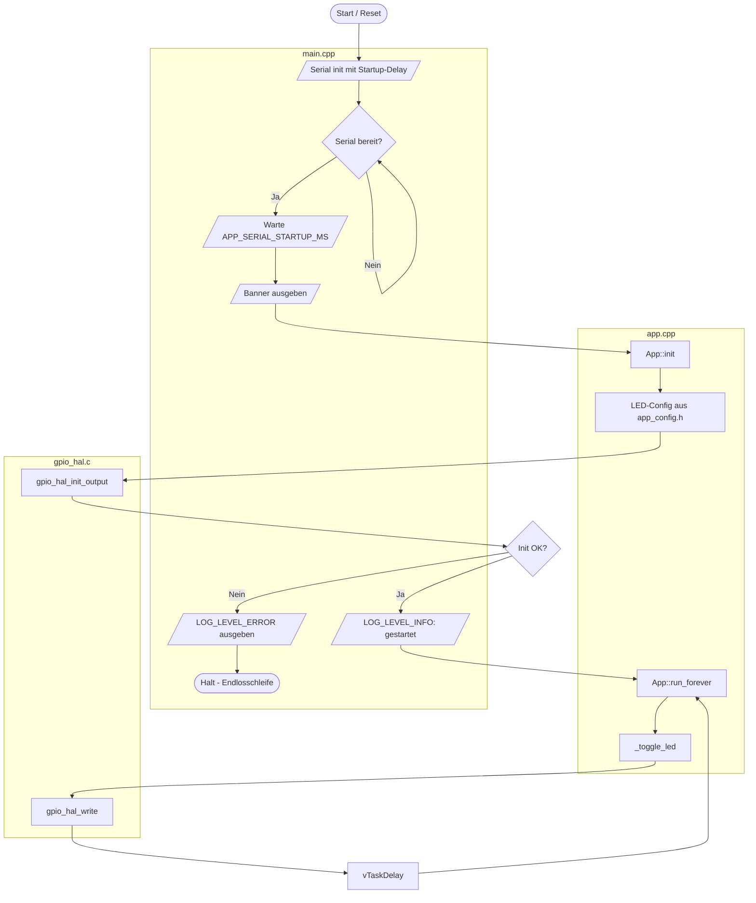
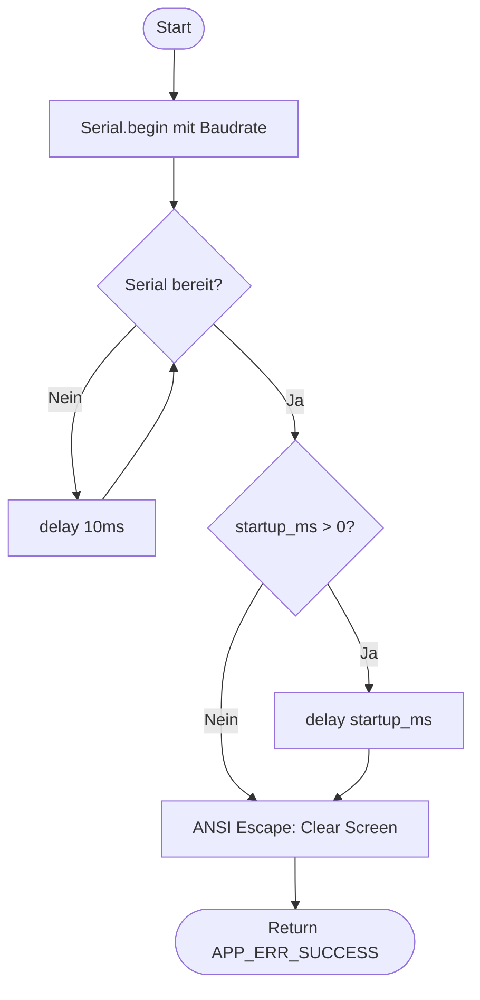
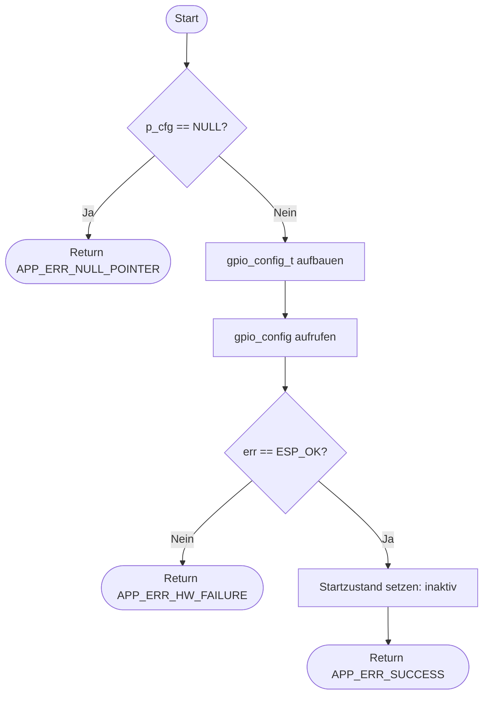
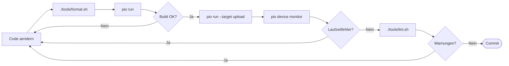
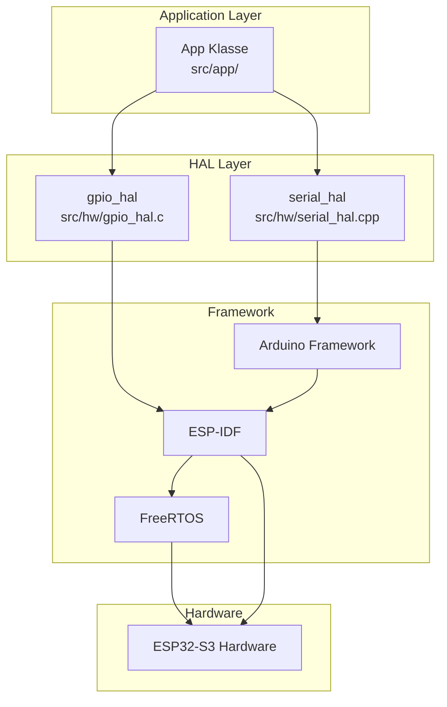

# Flussdiagramme

Programmablaufplaene (PAP) fuer das esp32s3_ref Projekt.

---

## 1) Laufzeit-Ablauf (Runtime)

Vom Reset bis zur Blink-Schleife mit Serial-Initialisierung:

**Legende:**
- Oval `([...])` = Start/Ende
- Rechteck `[...]` = Prozess/Anweisung
- Raute `{...}` = Entscheidung
- Parallelogramm `[/.../]` = Ein-/Ausgabe

---

## 2) Initialisierung Detail

Detaillierter Ablauf der `serial_hal_init()` Funktion:

---

## 3) GPIO HAL Init

Ablauf von `gpio_hal_init_output()`:

---

## 4) Entwicklungs-Workflow

Typischer Dev-Zyklus mit Tools:

---

## 5) Layer-Architektur

Schichtenmodell des Projekts:

**Regel:** Applikation greift nur ueber HAL auf Hardware zu, nie direkt auf Framework/Treiber.

---

## Symbolreferenz

| Symbol | Mermaid | Bedeutung |
|--------|---------|-----------|
| Oval | `([...])` | Start/Ende (Terminator) |
| Rechteck | `[...]` | Prozess/Anweisung |
| Raute | `{...}` | Entscheidung (Ja/Nein) |
| Parallelogramm | `[/...//]` | Ein-/Ausgabe |
| Pfeil | `-->` | Ablauflinie |
